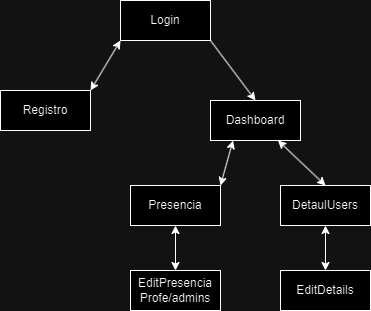

# A02-A01-SPRINT1_MarcR

Imagen del Wireframe de la app

A continuación las imagenes de las distintas pantallas

La primera pantalla al entrar a la app será donde haremos el inicio de sesion, o en su defecto registrarnos.
Consiste en que la cabecera será el logo y el nombre del colegio, en medio de la pantalla tendremos disponibles los bloques para hacer un inicio de sesion normal y corriente y por ultimo los botones de login o ir a registrarse

Pantalla registro

Arriba tenemos la cabecera con nombre y logo. 
En medio de la pantalla tenemos un formulario de registro para dar de alta a un usuario pidiendo una serie de datos.
Y abajo el pie de pagina

Dashboard

Es una distribucion simple de los elementos en pantalla, todos los elementos en este git son de baja fidelidad. 
La idea consiste en un mini menú situado debajo de la cabecera, cuya funcionalidad es aplicar filtros al display que se situa justo debajo y las opciones de poder ir o a la pantalla de Presencial o irse a detalles de usuario

Presencia

Hay una diferencia principal en esta pantalla, el objetivo principal es que el display de alumnos y profesores sea distinto, ya que un alumno solo va a poder mirar la presencia que ha tenido y aplicar filtros sobre esto, pero el profesor va a poder editar y ver mas que un alumno (lo mismo sucede con un administrador). 
Con los alumnos la idea principal es al entrar, por defecto salga un porcentaje total de horas asistidas/faltadas/retrasos y poder cambiar esta vista mediante filtros (pendiente de pensar como hacer)
Y los profesores/admins, al ser el objetivo pasar presencia y no verla, la idea es que pregunte a que clase quiere pasar lista y se despliegue un listado de alumnos con la opcion de poder pasar lista a cada uno. Tambien se puede editar las listas de asistencia, tanto historicas como hora actual (pendiente hacer figma)

Detail Users

Por último, la pantalla de detalles de usuario. Consiste en listar los detalles que se tengan de ese usuario en un formulario con la opcion de poder editarlo. 
El usuario (alumno o profe) puede agregar un nickname y una foto 
Para editar esta pantalla, se le da al boton de edicion y sin cambiar de pantalla ni enviar a otra, permite la edicion de los datos desplegados en el formulario 